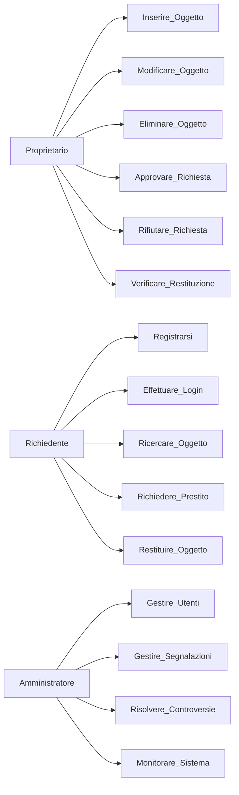
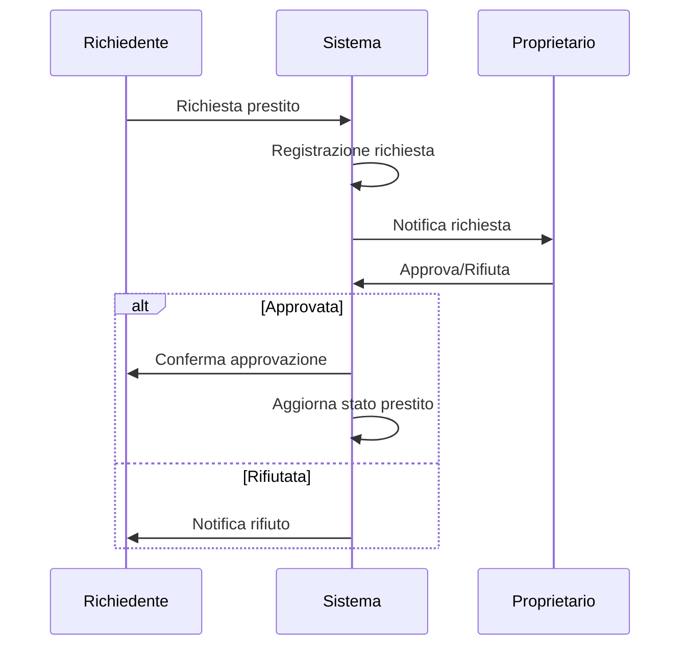
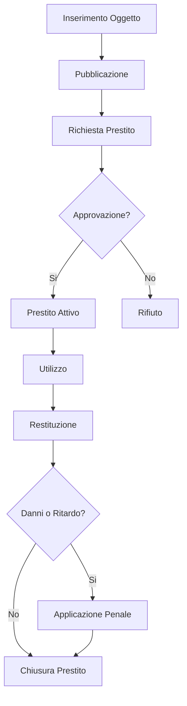
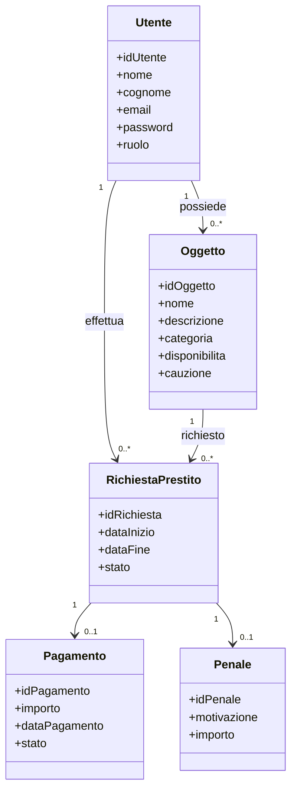
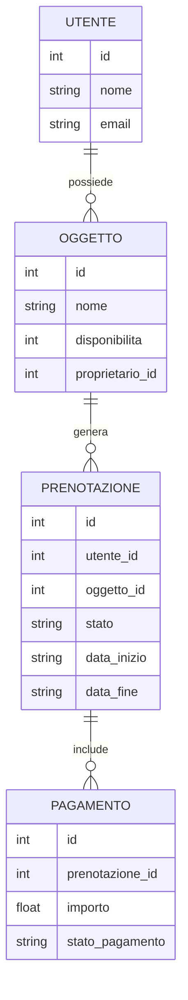
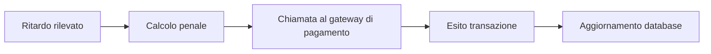

# UNIVERSITÀ TELEMATICA PEGASO

## Corso di Laurea in Informatica per le aziende digitali  
### Tesi di Laurea Triennale  

---

# Sharing Technologies  
# e progettazione di una piattaforma digitale per il prestito tra privati  

**Anno Accademico 2025/2026**

---

**Candidato:** Marco Sganga  
**Matricola:** 0312301245  

---

# Indice

- Introduzione
- 1. Le sharing technologies e l’economia della condivisione
- 2. Analisi e modello dell’applicazione
- 3. Architettura del sistema
- 4. Sicurezza e privacy
- 5. Limiti e sviluppi futuri
- Conclusioni
- Bibliografia
- Sitografia

---

# Introduzione

Negli ultimi anni le tecnologie digitali hanno cambiato radicalmente il modo in cui le persone accedono ai beni e ai servizi. Grazie alla diffusione di Internet e degli smartphone, oggi è possibile accedere a risorse senza necessariamente possederle.

Questo cambiamento ha favorito la nascita della Sharing Economy, un modello basato sulla condivisione tra individui. Le piattaforme digitali mettono in contatto utenti che offrono e richiedono beni o servizi.

L’obiettivo di questa tesi è progettare una piattaforma digitale per il prestito temporaneo di oggetti tra privati, basata su un modello sostenibile e collaborativo.

---

# 1. Le sharing technologies e l’economia della condivisione

## 1.1 Introduzione alla Sharing Economy

La sharing economy, definita alternativamente come economia della condivisione o consumo collaborativo, delinea un modello socio-economico emergente fondato sul riutilizzo, sullo scambio e sulla fruizione congiunta di beni, risorse e servizi tra individui o organizzazioni. Tale paradigma ha trovato la sua massima espressione grazie alla diffusione capillare delle tecnologie digitali di ultima generazione. Queste infrastrutture informatiche permettono di connettere in tempo reale, e con elevata efficienza allocativa, soggetti detentori di asset temporaneamente improduttivi con utenti intenzionati ad accedervi per un lasso di tempo limitato.

A differenza dei mercati tradizionali, storicamente imperniati sul concetto di proprietà e sull'accumulazione dei beni, l'alveo concettuale della sharing economy privilegia in modo sistematico la logica dell'accesso. In questo mutato scenario, il valore economico e l'utilità marginale non scaturiscono dal possesso esclusivo di una risorsa, bensì dalla concreta opportunità di goderne i benefici esclusivamente nel momento in cui se ne ravvisa la necessità. Questo approccio metodologico consente di ottimizzare i tassi di utilizzo delle risorse disponibili, comprimere le esternalità negative, azzerare le inefficienze strutturali e promuovere l'adozione di schemi di consumo orientati alla sostenibilità ambientale.

Sebbene le pratiche di mutuo soccorso e di condivisione di beni non costituiscano una novità in senso assoluto nella storia economica, l'avvento e la maturazione delle piattaforme web e mobile hanno consentito di superare le barriere d'adozione che in passato limitavano tali interazioni, prima confinate a ristrette reti fiduciarie locali. Attraverso interfacce applicative intuitive e protocolli software sicuri, gli utenti possono oggi catalogare, richiedere, prenotare e remunerare servizi in modo snello, abbattendo drasticamente i costi di transazione e strutturando mercati liquidi laddove prima sussistevano mercati frammentati o inesistenti.

L'ecosistema della condivisione si estende a una pluralità di settori merceologici, tra i quali spiccano la mobilità urbana, l'accoglienza ricettiva, l'erogazione di prestazioni professionali in regime di lavoro autonomo, il noleggio di strumentazioni tecniche e lo scambio simmetrico di competenze interne a comunità di pratica. In ciascuno di questi ambiti, le architetture digitali ricoprono il ruolo fondamentale di intermediari fiduciari e tecnologici, facilitando l'allineamento tra domanda e offerta e fornendo al contempo gli strumenti necessari alla gestione delle transazioni finanziarie e alla mitigazione del rischio morale.

### Principi fondamentali della Sharing Economy

I vettori teorici e operativi che qualificano in modo univoco l'economia collaborativa possono essere condensati nei seguenti punti programmatici:
*   **Utilizzo efficiente delle risorse preesistenti:** Incremento del ciclo di vita e del tasso d'uso di beni strutturalmente sottoutilizzati.
*   **Contrazione dei costi fissi:** Riduzione degli oneri economici individuali mediante la ripartizione delle spese di gestione tra più fruitori.
*   **Priorità dell'accesso sul possesso:** Sostituzione dell'acquisto permanente con formule di locazione o prestito a breve termine.
*   **Capitale sociale e fiducia sistemica:** Edificazione di comunità digitali regolate da meccanismi di trasparenza e reputazione condivisa.
*   **Intermediazione algoritmica:** Impiego di piattaforme web e mobile per orchestrare le interazioni e fluidificare l'incontro tra gli attori economici.
*   **Valorizzazione delle competenze latenti:** Monetizzazione o scambio di abilità professionali e tempo libero attraverso canali specializzati.

### Fattori di crescita

La transizione verso modelli di sharing economy è stata accelerata dalla convergenza sinergica di fattori di natura tecnologica, macroeconomica e culturale.

#### Diffusione degli smartphone

La disponibilità ubiqua di dispositivi mobili dotati di moduli di geolocalizzazione ha reso possibile l'accesso istantaneo alle piattaforme collaborative in qualsiasi contesto spazio-temporale. Le applicazioni dedicate consentono agli utenti di monitorare la disponibilità dei servizi in tempo reale, finalizzare prenotazioni immediate, comunicare con la controparte e completare i flussi di pagamento senza alcuna frizione geografica.
#### Connessioni Internet ad alta velocità

La progressiva evoluzione delle infrastrutture di telecomunicazione e la penetrazione della banda larga fissa e mobile hanno rimosso i colli di bottiglia nel trasferimento dei dati. La capacità di elaborare e trasmettere volumi informativi complessi in frazioni di secondo rappresenta il presupposto tecnico imprescindibile per il corretto funzionamento degli algoritmi di matching in tempo reale.

#### Familiarità con i servizi digitali

Nel corso dell'ultimo decennio, la popolazione ha sviluppato una profonda alfabetizzazione informatica, assimilando con naturalezza strumenti quali il commercio elettronico, i portafogli digitali, le transazioni contactless e le architetture cloud. Questo mutamento dei costumi ha abbattuto la diffidenza psicologica verso le transazioni online, normalizzando l'interazione economica mediata da uno schermo.

#### Maggiore sensibilità ambientale

I crescenti timori legati al cambiamento climatico e all'esaurimento delle materie prime hanno indotto una profonda revisione dei comportamenti d'acquisto. Condividere un bene strumentale anziché incentivarne la produzione ex novo si traduce in un minor impiego di energia e risorse primarie, intercettando la domanda di una platea di consumatori eticamente orientati.

### Benefici e opportunità

La sharing economy genera esternalità positive sia a livello microeconomico, per i singoli attori coinvolti, sia a livello macro-sociale. Sotto il profilo individuale, i fruitori beneficiano di un paniere di servizi a tariffe nettamente inferiori rispetto a quelle di mercato, mentre i fornitori ottengono canali alternativi di reddito valorizzando asset altrimenti improduttivi. Su scala collettiva, questo paradigma favorisce una distribuzione ottimale dei beni, stimola l'innovazione dal basso e riduce l'impronta ecologica delle attività antropiche.

Parallelamente, tale espansione ha evidenziato complessità di rilievo sotto il profilo regolatorio e giuslavoristico, specialmente in relazione alla tutela del consumatore finale, alla sovranità sui dati sensibili e alla conformità fiscale. Per ovviare a queste problematiche, le moderne architetture software integrano nativamente sofisticati sistemi di controllo dell'identità e protocolli di sicurezza standardizzati per assicurare la massima trasparenza operativa.

### Ruolo delle piattaforme digitali

Le piattaforme digitali fungono da vero e proprio motore abilitante dell'economia della condivisione. Lungi dal configurarsi come meri archivi statici di informazioni, esse mettono a disposizione l'intera infrastruttura necessaria a governare il ciclo di vita dell'interazione: dalla fase di onboarding e verifica dell'utente, alla pubblicazione degli annunci, fino alla gestione della messaggistica, alla transazione monetaria e al rilascio dei feedback.

Attraverso tale aggregazione di funzionalità, l'intermediario tecnologico trasforma una moltitudine atomizzata di utenti in una rete collaborativa coesa, capace di generare valore economico stabile e di ridefinire radicalmente i confini dell'economia contemporanea.

---

## 1.2 Evoluzione delle piattaforme digitali collaborative

Le piattaforme digitali collaborative hanno vissuto un percorso evolutivo profondo nel corso degli ultimi vent'anni, transitando da una configurazione embrionale di semplici aggregatori di annunci testuali a complessi ecosistemi transazionali integrati, capaci di supervisionare e governare ogni singola fase dell'interazione tra gli utenti.

Nelle prime fasi di sviluppo del Web (riconducibili all'alveo dei portali di classifieds), le piattaforme si limitavano a digitalizzare il paradigma delle bacheche cartacee. Il sistema svolgeva una funzione meramente informativa e passiva: metteva a disposizione uno spazio virtuale in cui pubblicare un'offerta, demandando l'intera gestione della trattativa, dello scambio del bene e del saldo economico a canali esterni e non tracciabili, quali la posta elettronica, la telefonia tradizionale o l'incontro di persona con pagamento in contanti. Questa asimmetria informativa esponeva i partecipanti a elevati rischi di frode e non offriva alcuna garanzia sulla qualità del servizio.
Con la maturazione tecnologica determinata dal Web 2.0, dal cloud computing e dall'avvento delle applicazioni native per smartphone, gli intermediari hanno progressivamente internalizzato le funzioni critiche del processo. L'obiettivo strategico si è spostato verso la progressiva eliminazione delle frizioni operative, centralizzando all'interno del perimetro software tutti gli strumenti necessari a blindare la sicurezza, l'affidabilità e la fluidità dell'esperienza utente.

### Autenticazione degli utenti

Le moderne piattaforme implementano rigorosi sistemi di Identity e Access Management (IAM) per certificare la corrispondenza tra l'identità digitale e l'identità reale del soggetto. Alle tradizionali credenziali alfanumeriche si sono affiancati protocolli di autenticazione a più fattori (MFA), login federati tramite identity provider affidabili e procedure automatizzate di Know Your Customer (KYC) basate sul riconoscimento ottico dei documenti d'identità e sull'analisi biometrica del volto. Questi presidi innalzano la barriera contro i tentativi di furto d'identità e riducono sensibilmente la presenza di attori malevoli nella community.

### Pagamenti digitali

L'integrazione nativa di gateway di pagamento sicuri (quali Stripe, PayPal o Adyen) ha rappresentato il vero spartiacque per la crescita del settore. Trattenendo i fondi all'interno di conti di deposito fiduciario (*escrow*) fino alla corretta esecuzione del servizio, la piattaforma tutela entrambe le parti. Questo meccanismo consente di automatizzare la gestione delle tariffe, i depositi cauzionali a garanzia, lo storno delle commissioni e l'erogazione di rimborsi tempestivi in caso di disservizio, garantendo la totale tracciabilità dei flussi finanziari nel rispetto delle normative antiriciclaggio.

### Sistemi di recensione e reputazione

Poiché la fiducia interpersonale rappresenta la risorsa primaria dell'economia collaborativa, le architetture software moderne dedicano ampia cura ai motori di valutazione reciproca. Attraverso recensioni bidirezionali e asincrone (rilasciate solo dopo il completamento della transazione per evitare ritorsioni nei giudizi), il sistema elabora la reputazione digitale di ciascun profilo. Questa metrica sociale non solo orienta le scelte d'acquisto dei futuri utilizzatori, ma funge da potente incentivo esogeno al mantenimento di standard comportamentali elevati e trasparenti.

### Messaggistica integrata

Al fine di scongiurare la disintermediazione e proteggere gli utenti da tentativi di phishing esterni, i sistemi collaborativi includono canali di messaggistica interna protetti. Questi moduli agevolano la definizione dei dettagli operativi e lo scambio di informazioni logistiche senza costringere l'utente a divulgare dati privati come il numero di telefono cellulare. Inoltre, conservando lo storico delle conversazioni sui server della piattaforma, l'amministratore dispone di evidenze oggettive e immodificabili per dirimere eventuali controversie o contestazioni.

### Gestione delle transazioni

Le piattaforme di ultima generazione si configurano come veri e propri sistemi ERP (*Enterprise Resource Planning*) tarati sulle dinamiche C2C. Esse monitorano in tempo reale il ciclo di vita della transazione: dalla verifica algoritmica dei calendari di disponibilità, alla ricezione della proposta, fino alla generazione di ricevute digitali, al tracking logistico dell'asset e alla finalizzazione dello stato dell'ordine. Questa gestione centralizzata riduce drasticamente l'overhead cognitivo per gli utenti e massimizza l'efficienza complessiva dei processi.
### Impatto dell'evoluzione tecnologica

L'integrazione sinergica di tali componenti ha trasformato i portali collaborativi in infrastrutture digitali ad altissima complessità, progettate per supportare carichi di lavoro elevati in termini di connessioni simultanee e transazioni finanziarie atomiche. L'adozione di architetture a microservizi distribuite su ambienti cloud consente un ridimensionamento dinamico delle risorse computazionali e garantisce elevati standard di continuità operativa e tolleranza ai guasti.

Il ruolo dell'infrastruttura tecnologica è dunque mutato radicalmente: da mero palcoscenico passivo per annunci economici, essa è divenuta l'autorità di governance e l'elemento regolatore incaricato di definire le regole del gioco, validare le interazioni e strutturare i legami di fiducia che rendono sostenibile l'intero ecosistema.

---

## 1.3 Principali modelli di sharing economy

Il panorama della sharing economy si articola in una tassonomia diversificata di modelli di scambio e utilizzo delle risorse. Tali declinazioni operative si differenziano in funzione del regime proprietario applicato, delle modalità tecniche di accesso al bene e del grado di coinvolgimento dell'intermediario algoritmico. Di seguito vengono analizzate le macro-categorie prevalenti.

### 1.3.1 Vendita tra privati (Second-hand Economy)

Questo paradigma si focalizza sul trasferimento definitivo e permanente del diritto di proprietà di un asset da un privato a un altro. La piattaforma digitale interviene esclusivamente nella fase di abbinamento tra l'offerta del venditore e la domanda dell'acquirente, senza trattenere alcuna facoltà di godimento sul bene scambiato.

Dal punto di vista dell'ortodossia economica, si tratta della digitalizzazione dei tradizionali mercati dell'usato o di seconda mano.

Le sue specificità strutturali includono:
*   La cessione irreversibile del titolo proprietario dietro corrispettivo economico.
*   L'assenza di schemi di condivisione sincronica o diacronica della risorsa nel tempo.
*   L'esaurimento del valore transazionale e del legame con la piattaforma all'atto della consegna.
*   Il ruolo della piattaforma circoscritto alla facilitazione del contatto e alla sicurezza del pagamento (es. Vinted, eBay, Wallapop).

Benché una parte della dottrina tenda a escludere questo modello dall'alveo della sharing economy pura — assimilandolo piuttosto a una branca del commercio elettronico Peer-to-Peer (C2C) — esso viene comunemente incluso nelle trattazioni estese per la sua intrinseca capacità di estendere il ciclo di vita dei prodotti, rallentando l'immissione di nuovi rifiuti nell'ambiente.

### 1.3.2 Noleggio e utilizzo temporaneo (Product-Service Systems)

In questo schema negoziale, il diritto di proprietà sul bene resta saldamente in capo al fornitore originario (sia esso un privato cittadino o un operatore societario), mentre l'utente acquisisce esclusivamente la facoltà di fruizione e di utilizzo per un arco temporale rigidamente circoscritto, a fronte del pagamento di una tariffa proporzionale all'uso.

Rappresenta uno dei modelli archetipici e più puri della sharing economy moderna, in quanto mira espressamente a saturare la capacità produttiva di beni durevoli ad alto costo di acquisto.

Le sue specificità strutturali includono:
*   La netta separazione tra la titolarità del bene e la sua concreta disponibilità d'uso.
*   L'accesso frazionato nel tempo, tarato sulle reali necessità del fruitore.
*   La strutturazione di tariffe flessibili regolate su base oraria, giornaliera o volumetrica.
*   L'intervento pervasivo della piattaforma nella gestione delle prenotazioni e nella manutenzione degli asset.

Esempi consolidati di tale dinamica sono riscontrabili nei servizi di car sharing (es. Share Now), bike sharing urbano e nelle piattaforme di locazione flessibile di attrezzature professionali o hobbistiche.

### 1.3.3 Servizi condivisi (On-Demand Economy)

Questo modello prescinde dalla condivisione di un oggetto fisico statico per concentrarsi sulla messa a disposizione di prestazioni d'opera, competenze professionali o servizi logistici coordinati da un'infrastruttura software centralizzata che governa una rete capillare di fornitori autonomi.

La ratio economica risiede nell'aggregazione istantanea della domanda e nell'ottimizzazione dei tempi della forza lavoro, garantendo uniformità negli standard qualitativi e automazione nei flussi di pagamento.

Le sue specificità strutturali includono:
*   La centralità della prestazione immateriale o del servizio rispetto al bene materiale.
*   Il monitoraggio algoritmico della qualità e dei tempi di esecuzione tramite metriche standardizzate.
*   L'arruolamento di una flotta di operatori indipendenti che agiscono su base flessibile.
*   L'elevatissima scalabilità del modello di business della piattaforma, esente da significativi investimenti in asset fisici.
Le declinazioni più note includono le piattaforme di ride-hailing (es. Uber), le reti di food delivery (es. Deliveroo) e i marketplace per l'ingaggio di programmatori e creativi freelance (es. Fiverr, Upwork).

### 1.3.4 Prestito tra privati (Peer-to-Peer Lending)

Il modello del prestito si fonda sulla mutua concessione di un bene tra due privati cittadini, senza che si verifichi alcun passaggio di proprietà e, frequentemente, in totale assenza di finalità speculative o di profitto commerciale diretto. L'interazione può prevedere un micro-indennizzo simbolico o configurarsi come puro atto di reciprocità all'interno di una comunità circoscritta.

Questo schema rappresenta l'estensione digitale più fedele dello spirito originario del movimento collaborativo, ponendo l'accento sulla solidarietà di quartiere e sull'edificazione di solide reti di fiducia interpersonale.

Le sue specificità strutturali includono:
*   La stabilità della proprietà in capo all'utente disponente e l'obbligo di restituzione integra della risorsa.
*   La temporaneità intrinseca dello scambio, calibrata su logiche di prossimità.
*   La prevalenza di motivazioni etiche, sociali o di mutuo vantaggio rispetto al puro guadagno economico.
*   La centralità dei sistemi di garanzia e di responsabilità contrattuale volti a preservare l'integrità del bene.
In questa categoria si collocano le reti di scambio di vicinato, le banche del tempo digitalizzate e le piattaforme software dedicate alla condivisione di utensili e attrezzature domestiche tra residenti della medesima area urbana.

---

## 1.4 Differenze rispetto ai marketplace tradizionali

Sebbene l'opinione pubblica tenda spesso a sovrapporre i concetti di marketplace tradizionale e piattaforma di sharing economy in virtù del comune utilizzo di interfacce web, un'analisi rigorosa rivela discrepanze strutturali sul piano delle logiche economiche, della generazione del valore e della filosofia di consumo.

Mentre nei marketplace tradizionali l'architettura è orientata a finalizzare contratti di compravendita di prodotti o servizi d'origine professionale, sancendo il passaggio definitivo del titolo di proprietà dal venditore al compratore, la sharing economy riorganizza il processo attorno alla massimizzazione dell'utilità di asset già esistenti, dislocando il focus dall'acquisto al godimento temporaneo della risorsa.

Questa divergenza assiomatica si traduce in una radicale riconfigurazione dei ruoli degli attori economici e delle metriche di sostenibilità del sistema.

### Accesso versus possesso

Il fulcro discriminante risiede nella contrapposizione ontologica tra proprietà e accesso. Nelle maglie dell'economia lineare, il soddisfacimento di un bisogno passa necessariamente attraverso l'atto dell'acquisto. L'acquirente incamera il bene nel proprio patrimonio, assumendone non solo i benefici ma anche tutti i costi occulti legati all'ammortamento, alla manutenzione ordinaria, allo stoccaggio fisico e all'eventuale smaltimento per obsolescenza.

Nella sharing economy, l'utente scinde l'utilità funzionale del bene dalla sua materialità giuridica. Non vi è alcun interesse a detenere la proprietà a lungo termine di un oggetto, specialmente se caratterizzato da un utilizzo sporadico; l'esigenza si limita alla fruizione della prestazione d'uso nell'esatto momento in cui essa si rende necessaria. 

Questo approccio si rivela dirompente per tutti quei beni ad alto valore aggiunto che passano la maggior parte della loro vita utile in stato di inattività, come i veicoli privati, le macchine utensili da cantiere, i dispositivi fotografici professionali o le seconde case.

### Riutilizzo dei beni

I marketplace tradizionali sono strutturalmente legati alla filiera della produzione continua. Il loro modello di business prospera sull'incremento dei volumi di vendita di nuovi prodotti, incentivando cicli di sostituzione rapidi che alimentano la macchina industriale ma mettono sotto pressione l'ambiente.

La sharing economy opera secondo logiche di economia circolare, estraendo valore dall'ottimizzazione dello stock di risorse esistenti. Attraverso la condivisione, beni che rimarrebbero inerti all'interno di garage o magazzini per oltre il novanta percento del tempo vengono rimessi in circolo, moltiplicando il loro tasso d'uso complessivo.

Si consideri l'esempio classico dell'autovettura privata: essa staziona parcheggiata per la quasi totalità della giornata, costituendo un costo passivo per il proprietario. Una piattaforma collaborativa permette di intercettare questa capacità latente, mutando una passività economica in una risorsa dinamica capace di generare utilità diffusa ed entrate integrative. Questo meccanismo di saturazione degli asset riduce la pressione estrattiva, rallentando la necessità di avviare nuove linee di produzione industriale.

### Sostenibilità

Il concetto di sostenibilità è intrinsecamente radicato nell'architettura concettuale delle piattaforme collaborative. Laddove i canali distributivi tradizionali misurano il successo sul PIL e sull'espansione lineare delle vendite, il consumo collaborativo mira a una drastica riduzione dell'intensità materiale dei consumi.

La condivisione sistematica consente di conseguire i seguenti traguardi ecologici:
*   **Contrazione dei flussi estrattivi:** La minore richiesta di nuovi prodotti frena l'approvvigionamento di materie prime vergini.
*   **Decoupling economico:** Scissione della crescita economica dall'aumento dei consumi energetici e materiali.
*   **Ottimizzazione della logistica inversa:** Riduzione del volume complessivo dei rifiuti solidi urbani grazie all'estensione della vita utile dei manufatti.
*   **Razionalizzazione degli spazi urbani:** Minore necessità di aree dedicate allo stoccaggio e al parcheggio di beni privati sottoutilizzati.
*   **Diffusione di una cultura della responsabilità:** Transizione etica del consumatore da mero accumulatore a custode temporaneo di risorse collettive.

Sebbene l'impatto ecologico effettivo resti subordinato alle modalità d'uso e ai potenziali effetti di rimbalzo (*rebound effects*), la letteratura concorda nel considerare la sharing economy uno dei pilastri per l'implementazione di modelli di sviluppo a basso impatto carbonico.

### Ruolo bidirezionale degli utenti

Nei marketplace tradizionali la segmentazione del mercato è rigida e unidirezionale: da un lato vi è il merchant professionista (B2C) o il top seller commerciale, dall'altro il consumatore finale passivo. I flussi di valore e di cassa seguono un vettore lineare e non invertibile.

Nel tessuto della sharing economy questa dicotomia si dissolve, lasciando spazio alla figura ibrida del **prosumer** (producer-consumer). All'interno di una piattaforma collaborativa, i ruoli non sono scritti nello status giuridico dell'utente, ma cambiano dinamicamente in base alle contingenze. Il medesimo soggetto che in una determinata circostanza agisce come fornitore di una risorsa, concedendo in prestito un proprio attrezzo professionale, può l'indomani mutarsi in fruitore di un servizio offerto da un altro membro della medesima rete.

Questo trasforma la piattaforma da mero catalogo di vendita in un ecosistema sociale orizzontale e simmetrico, in cui gli utenti partecipano in modo corale sia alla generazione sia al consumo del valore, cementando legami comunitari fondati sulla reciprocità.

### Confronto tra i due modelli

La tabella sottostante sintetizza in modo analitico le divergenze strutturali che separano i due paradigmi di intermediazione digitale:

| Aspetto | Marketplace Tradizionale | Sharing Economy |
| :--- | :--- | :--- |
| **Obiettivo principale** | Transazione commerciale e compravendita | Condivisione e accesso temporaneo alle risorse |
| **Proprietà del bene** | Trasferita in modo definitivo all'acquirente | Mantenuta stabilmente in capo al proprietario |
| **Utilizzo delle risorse** | Basato sul possesso e sull'esclusività d'uso | Basato sull'accesso frazionato e asincrono |
| **Ruolo degli utenti** | Netta separazione tra venditore e acquirente | Utenti bidirezionali con ruoli intercambiabili (*prosumer*) |
| **Valorizzazione dei beni** | Immissione sul mercato di nuovi beni commerciali | Ottimizzazione di asset preesistenti e inerti |
| **Impatto sulla sostenibilità** | Collegato alle dinamiche dell'economia lineare | Intrinsecamente orientato all'economia circolare |

### Considerazioni finali

In ultima analisi, il discrimine tra la sharing economy e i marketplace tradizionali non attiene a profili puramente tecnologici o informatici, ma investe la natura stessa della transazione e la visione antropologica del consumo. Laddove il commercio elettronico convenzionale ottimizza la catena di distribuzione per accelerare la vendita del prodotto, l'economia collaborativa scardina il feticcio della proprietà, dimostrando come l'intermediazione algoritmica possa essere posta al servizio di un'allocazione più intelligente, equa e sostenibile delle risorse tangibili e intangibili della società.

---

## 1.5 Vantaggi e criticità

L'affermazione su larga scala dell'economia della condivisione ha ridisegnato i contorni dell'interazione tra cittadini, imprese e beni strumentali. L'architettura delle piattaforme collaborative ha dimostrato di saper generare modelli organizzativi inediti, capaci di estrarre valore da segmenti di inefficienza strutturale che i mercati tradizionali non erano in grado di intercettare.

Tuttavia, come ogni profonda trasformazione nei sistemi di produzione e consumo, la sharing economy non è esente da zone d'ombra. La transizione verso un modello basato sulle relazioni peer-to-peer solleva complessità di natura tecnica, sociologica, legale e comportamentale che richiedono un'analisi attenta e lo sviluppo di contromisure adeguate all'interno del codice software e dei quadri normativi.

### Vantaggi della Sharing Economy

Il successo globale delle formule collaborative risiede in una serie di benefici tangibili che impattano positivamente sull'efficienza microeconomica e sul benessere collettivo.

### Riduzione degli sprechi

Il principale merito ecologico ed economico del consumo collaborativo risiede nel contrasto sistematico al fenomeno dell'inattività degli asset. La società contemporanea è caratterizzata da una sovrabbondanza di beni durevoli privati che passano la maggior parte del proprio ciclo di vita confinati in uno stato di totale inutilizzo.

Le tecnologie di sharing spezzano questa inefficienza, offrendo canali agili per rimettere in circolazione tali oggetti. Aumentando il tasso di saturazione del bene, si soddisfa la domanda di una platea più vasta senza dover attivare nuove catene di montaggio industriali, riducendo drasticamente lo spreco di energia e lo smaltimento precoce di manufatti ancora funzionanti.

### Ottimizzazione delle risorse

Sotto il profilo allocativo, le piattaforme digitali riducono a zero le asimmetrie informative che in passato rendevano impossibile il coordinamento tra estranei. Grazie ad algoritmi di matching evoluti e alla geolocalizzazione, il sistema è in grado di mappare istantaneamente la dislocazione geografica della domanda e dell'offerta, allocando la risorsa esatta all'utente che ne manifesta la necessità nell'esatto momento e luogo richiesti.

Questa ottimizzazione non si limita ai soli beni materiali, ma si estende fluidamente al capitale umano, consentendo la condivisione di tempo libero, competenze specifiche e spazi logistici che altrimenti rimarrebbero improduttivi.

### Accesso a beni e servizi costosi

Un rilevante impatto sociale della sharing economy risiede nella democratizzazione dei consumi. Molti beni strumentali o di comfort presentano barriere economiche all'ingresso proibitive per ampie fasce della popolazione, a causa degli elevati costi di acquisto e dei successivi oneri di gestione.

Frazionando il costo complessivo dell'asset sul numero effettivo di ore o giorni di effettivo utilizzo, la condivisione abbatte queste barriere. L'utente può così fruire di attrezzature ad alta tecnologia, veicoli di segmenti superiori o alloggi in contesti esclusivi corrispondendo soltanto una frazione infinitesimale del valore patrimoniale del bene, ampliando le proprie opportunità operative e migliorando la qualità della vita.

### Benefici ambientali e sociali

I riflessi macroscopici del consolidamento di questo paradigma investono la sfera della coesione sociale e della tutela ecologica attraverso dinamiche virtuose:
*   **Contenimento delle emissioni:** Riduzione della CO2 complessiva grazie a stili di vita improntati alla condivisione dei vettori energetici e dei trasporti.
*   **Mitigazione del consumismo impulsivo:** Sostituzione della gratificazione legata all'acquisto con il valore dell'esperienza d'uso.
*   **Rigenerazione dei legami comunitari:** Nascita di reti solidali di quartiere che spezzano l'isolamento atomizzato tipico delle moderne aree metropolitane.
*   **Inclusione economica:** Opportunità per i soggetti a basso reddito di generare entrate extra integrando il proprio bilancio familiare attraverso la messa a disposizione di beni propri.

### Criticità della Sharing Economy

A fronte di tali indiscutibili punti di forza, l'operatività concreta all'interno dei mercati peer-to-peer sconta elementi di vulnerabilità strutturale che possono minare la stabilità dell'intero ecosistema se non governati con rigore progettuale.

### Mancanza di fiducia tra gli utenti

La fiducia rappresenta l'infrastruttura intangibile ma indispensabile su cui poggia l'intera architettura collaborativa. Nelle transazioni orizzontali che coinvolgono soggetti privi di un background relazionale pregresso, il rischio di selezione avversa è elevatissimo.

L'incertezza circa l'onestà della controparte, la corrispondenza dell'annuncio allo stato reale del bene e il timore di subire truffe o inadempienze contrattuali costituiscono la principale barriera psicologica all'adozione del modello. Se la piattaforma non è in grado di implementare architetture reputazionali oggettive e infallibili, il mercato rischia il collasso per asfissia fiduciaria.

### Rischi comportamentali

Il disallineamento degli incentivi di proprietà introduce il classico problema del rischio morale (*moral hazard*). Quando un individuo utilizza un bene di cui non è proprietario, e per il quale non risponde patrimonialmente in modo diretto, tende a manifestare livelli di cura e diligenza significativamente inferiori rispetto a quelli che riserverebbe a un oggetto proprio.
Questo si traduce in una casistica problematica ricorrente:
*   Incuria grave nella custodia e usura precoce dell'asset dovuto a un utilizzo improprio.
*   Omessa segnalazione di malfunzionamenti o danni occulti occorsi durante il periodo di locazione.
*   Inadempimento dei termini temporali fissati per la riconsegna, con conseguente danno per i fruitori successivi.
*   Condotte opportunistiche tese a eludere le regole interne per scopi fraudolenti.

### Sicurezza dei pagamenti

La gestione dei flussi monetari all'interno di reti C2C rappresenta un bersaglio sensibile per attacchi informatici e tentativi di estorsione. La necessità di raccogliere dati finanziari di utenti privati impone l'adozione di architetture di cybersecurity prive di singoli punti di vulnerabilità.
Un sistema di pagamento claudicante, esposto a fenomeni di chargeback fraudolenti, intercettazione dei dati delle carte di credito o ritardi ingiustificati nel trasferimento delle competenze economiche, distrugge istantaneamente la credibilità dell'intermediario, provocando la fuga degli utenti verso i canali tradizionali.

### Aspetti normativi e legali

La rapidità dell'evoluzione tecnologica ha surclassato la capacità di normazione dei legislatori nazionali, determinando la nascita di ampi vuoti normativi e zone d'ombra interpretative. I nodi più complessi attengono alla perimetrazione della responsabilità civile in caso di sinistri o danni a terzi derivanti dall'uso di beni condivisi.

Sussistono inoltre aspre dispute in materia di diritto del lavoro (connesso alle tutele dei lavoratori della gig economy), di conformità fiscale dei redditi occasionali generati dai privati e di asimmetria competitiva con gli operatori economici tradizionali, i quali accusano le piattaforme di esercitare forme di concorrenza sleale beneficiando di regimi regolatori deregolamentati.

### Considerazioni finali

L'esame bilanciato della sharing economy evidenzia un quadro in cui i benefici in termini di efficienza macroeconomica e sostenibilità ecologica risultano strutturali e dirompenti. Tuttavia, la sostenibilità a lungo termine di questo paradigma resta indissolubilmente legata alla capacità dei progettisti software di edificare sistemi di governance tecnologica avanzati. Solo attraverso l'implementazione nel codice di robusti moduli di crittografia, algoritmi di rilevamento delle frodi, sistemi di autenticazione biometrica e severe policy di mitigazione del rischio comportamentale è possibile blindare la fiducia degli utenti, trasformando le criticità operative in punti di forza competitivi.

---

## 1.6 Collegamento con la piattaforma proposta

I costrutti teorici, i modelli tassonomici e i vettori socio-economici propri della sharing economy analizzati nei paragrafi precedenti non rimangono astrazioni dottrinali, ma trovano una precisa traduzione ingegneristica e un'applicazione empirica nella piattaforma software progettata e sviluppata nell'ambito di questo lavoro di tesi. Il sistema si configura come un'architettura digitale espressamente dedicata alla gestione sistematica del **prestito di beni tra privati (Peer-to-Peer Goods Lending)**, consentendo a una comunità circoscritta di utenti di condividere asset materiali sottoutilizzati all'interno di un perimetro controllato, tracciabile e sicuro.

La soluzione software proposta si colloca nel cuore pulsante dell'economia collaborativa, declinando concretamente il passaggio dal possesso esclusivo all'accesso temporaneo. Attraverso l'applicazione, i membri dell'ecosistema possono catalogare oggetti di loro proprietà — il cui tasso d'uso sia strutturalmente basso — e concederne il diritto di godimento ad altri utenti per intervalli temporali definiti, estraendo utilità sociale ed economica da risorse che altrimenti rimarrebbero inerti. Questo approccio contrasta l'obsolescenza da inattività, minimizza gli sprechi localizzati e promuove pratiche di consumo ecocompatibili.

### Obiettivi della piattaforma

Il progetto nasce con la specifica finalità di sanare le vulnerabilità intrinseche che storicamente viziano le pratiche tradizionali del prestito informale. Nello scenario dei rapporti interpersonali analogici, la condivisione di un oggetto avviene solitamente mediante accordi verbali deboli e comunicazioni destrutturate su canali di messaggistica istantanea generalisti. Questa assenza di formalizzazione rende estremamente complessa la determinazione delle responsabilità in caso di danneggiamento, genera frequenti incomprensioni sui tempi di restituzione e inibisce la scalabilità dello scambio al di fuori della ristretta cerchia delle conoscenze intime.

Per superare tali barriere all'adozione, il sistema introduce un'infrastruttura software centrale incaricata di normare, monitorare e blindare l'intero ciclo di vita del prestito.

Gli obiettivi strategici perseguiti dall'applicazione possono essere dettagliati come segue:
*   **Istituzionalizzare il prestito P2P:** Trasformare un atto informale in una transazione digitale strutturata e provvista di valore contrattuale interno.
*   **Massimizzare l'efficienza degli asset:** Offrire una vetrina digitale che renda visibili e accessibili risorse private altrimenti invisibili al mercato.
*   **Innalzare la fiducia sistemica:** Implementare protocolli di verifica identitaria e tracciabilità operati da un soggetto terzo neutrale.
*   **Abattere il rischio morale:** Introdurre vincoli e sanzioni software volti a responsabilizzare l'utente circa l'integrità del bene altrui.
*   **Automatizzare la logistica documentale:** Gestire in modo centralizzato scadenze, calendari, stati d'uso e ricevute senza oneri per i partecipanti.

### Sistema di prenotazioni strutturate

La prima contromisura tecnica implementata nell'applicazione è rappresentata dal motore di prenotazione strutturata a stati vincolati. A differenza degli accordi verbali, volatili per natura, ogni transazione viene codificata all'interno del database relazionale e risponde a una macchina a stati finiti rigidamente normata dal codice.

L'utente richiedente interroga il catalogo mediante filtri semantici e geografici, verifica la disponibilità temporale dell'asset attraverso un calendario dinamico aggiornato in tempo reale e inoltra una richiesta formale di prenotazione. Il proprietario riceve una notifica push e conserva la facoltà di accettare o declinare l'istanza sulla base del profilo del richiedente. 

All'atto dell'approvazione, il sistema blinda lo slot temporale e avvia il tracking della transazione, storicizzando ogni transizione di stato (es. *In attesa*, *Approvato*, *Ritirato*, *In Uso*, *Riconsegnato*) ed emettendo token di verifica univoci che le parti devono scambiarsi al momento della consegna e della restituzione fisica del bene, eliminando alla radice contestazioni sulla cronologia degli eventi.

### Pagamenti sicuri

Per conferire robustezza al servizio e coprire gli eventuali costi vivi di usura o di noleggio, la piattaforma integra un modulo di gestione dei pagamenti digitali basato su protocolli di crittografia avanzati. Le transazioni finanziarie vengono regolate tramite gateway certificati conformi agli standard PCI-DSS, isolando l'ambiente applicativo dai dati sensibili delle carte di credito degli utenti.

Il software gestisce nativamente la logica del deposito cauzionale temporaneo: all'atto della conferma della prenotazione, una quota di garanzia viene pre-autorizzata sulla carta del fruitore e congelata in un conto di escrow fiduciario. Tali fondi vengono sbloccati e riaccreditati solo a seguito della verifica positiva dello stato del bene al momento della riconsegna. Questa architettura finanziaria centralizzata garantisce trasparenza, elimina la necessità di scambi di denaro contante e fornisce uno storico contabile immodificabile per finalità di audit interno.

### Sistema di penalità

L'elemento di maggiore innovazione ingegneristica introdotto nella piattaforma per mitigare i rischi comportamentali e l'incuria è costituito dall'algoritmo nativo di penalizzazione progressiva. Consapevoli del fatto che la stabilità di una comunità peer-to-peer poggia sul rispetto delle regole di convivenza civile, si è scelto di codificare nel software un sistema sanzionatorio automatizzato volto a disincentivare le condotte opportunistiche.

Il sistema interviene tempestivamente applicando sanzioni pecuniarie o limitazioni d'uso al verificarsi delle seguenti violazioni:
*   **Oltrepassamento dei termini:** Ritardo non concordato nella riconsegna del bene, sanzionato con tariffe orarie maggiorate detratte dalla cauzione.
*   **Recesso tardivo:** Annullamento della prenotazione a ridosso della data di ritiro, volto a tutelare il proprietario dal mancato guadagno o dall'inutilizzo programmato.
*   **Dichiarazioni mendaci:** Segnalazione di danni da parte del proprietario validata dal sistema di controllo documentale della piattaforma.
*   **Inosservanza delle policy:** Comportamenti scorretti rilevati dai moduli di feedback bidirezionali.

Le penalità inflitte non si limitano all'aspetto economico, ma decurtano in modo permanente il punteggio di affidabilità pubblica dell'utente, limitando la sua visibilità all'interno del network o decretando il ban temporaneo dal sistema nei casi di recidiva grave. L'approccio perseguito non è meramente punitivo, bensì risponde a una logica di prevenzione e di allineamento degli incentivi comportamentali.

### Creazione di un ecosistema basato sulla fiducia

La convergenza sinergica del motore di prenotazione, dei flussi finanziari protetti in escrow e dell'algoritmo sanzionatorio permette alla piattaforma di ergersi a garante super partes dell'interazione sociale. L'applicazione cessa di essere un mero intermediario passivo per assumere un ruolo proattivo nella mitigazione del rischio transazionale.

Gli utenti operano all'interno di un ambiente digitale protetto, sapendo che ogni azione è tracciata, che i capitali sono tutelati da crittografia e che i comportamenti lesivi della community vengono intercettati e sanzionati tempestivamente. Questa rete di protezione tecnologica abbatte le barriere psicologiche all'ingresso, incentivando la condivisione di asset anche tra soggetti completamente estranei.

### Conclusioni

La piattaforma software descritta in questa tesi rappresenta la traduzione in codice dei postulati della sharing economy applicati al segmento del prestito P2P. Superando le fragilità strutturali intrinseche ai modelli informali, l'applicazione dimostra come un'accorta progettazione ingegneristica possa addomesticare le criticità relazionali dei mercati orizzontali, fornendo uno strumento affidabile, scalabile e sicuro capace di valorizzare le risorse inespresse del territorio e di promuovere un'autentica cultura della sostenibilità collaborativa.

---

## 1.7 Considerazioni finali

L'analisi svolta nel corso di questo capitolo introduttivo evidenzia come la sharing economy non si configuri come un fenomeno passeggero o una moda transitoria legata ai consumi giovanili, bensì come una mutazione strutturale e irreversibile dei modelli di produzione, distribuzione e consumo, catalizzata in modo decisivo dalla digitalizzazione dei processi economici. L'intermediazione algoritmica ha dimostrato di saper scardinare i dogmi dell'economia lineare del Novecento, provando che la cooperazione orizzontale assistita dalla tecnologia può generare livelli di efficienza allocativa superiori rispetto a quelli basati sull'accumulazione capitalistica della proprietà privata.

Nel corso della sua evoluzione, questo paradigma ha dato prova di saper rispondere con efficacia alle grandi sfide macroeconomiche del nostro tempo, coniugando le istanze di flessibilità e ottimizzazione finanziaria dei singoli con l'imperativo categorico della transizione ecologica e della riduzione dell'impronta carbonica. Spostando l'asse valoriale dal possesso esclusivo all'accesso condiviso, le piattaforme collaborative offrono una via d'uscita alla crisi di sovrapproduzione di beni durevoli, massimizzando l'utilità estratta da ogni singolo grammo di materia prima immesso nel circuito economico globale.

In questa transizione di portata storica, l'infrastruttura tecnologica ha smesso di ricoprire un ruolo meramente strumentale per assurgere a istituzione di governance ed elemento di regolazione sociale. I moduli software che gestiscono i flussi d'identità, la messaggistica interna, i gateway finanziari e le matrici reputazionali costituiscono il vero tessuto connettivo che rende possibile la cooperazione tra estranei su scala planetaria, sostituendo le vecchie garanzie istituzionali ed esogene con relazioni fiduciarie endogene mediate dall'algoritmo.

Nonostante il quadro complessivo evidenzi opportunità straordinarie, il consolidamento definitivo del modello resta subordinato alla capacità degli sviluppatori e dei policy maker di risolverne i nodi critici, con particolare riferimento alle asimmetrie informative, ai rischi di azzardo morale degli utilizzatori, alla blindatura informatica dei dati e alla definizione di quadri normativi capaci di tutelare l'equità fiscale e la concorrenza leale senza soffocare l'innovazione tecnologica che pulsa dal basso.

All'interno di questo scenario macroeconomico, il settore del prestito di beni tra privati (Peer-to-Peer Goods Lending) si staglia come uno dei campi d'applicazione più fertili e promettenti. I tassi di inutilizzo che caratterizzano i beni di consumo durevoli all'interno dei contesti urbani rappresentano uno spreco intollerabile dal punto di vista dell'efficienza termodinamica ed economica. L'edificazione di piattaforme software capaci di intercettare questa capacità latente e di normare lo scambio attraverso protocolli rigidi apre la strada a una ridefinizione virtuosa delle economie di prossimità.

La piattaforma progettata ed esposta in questo lavoro di tesi si inserisce con precisione in questo filone di ricerca e sviluppo software, proponendo soluzioni ingegneristiche puntuali alle problematiche che storicamente frenavano il prestito interpersonale. L'integrazione architetturale di una macchina a stati per le prenotazioni, di un motore di escrow per la sicurezza monetaria e di un algoritmo per la gestione delle penalità dimostra come sia possibile edificare un ecosistema collaborativo robusto, resiliente e pienamente sostenibile nel lungo periodo.

In conclusione, la sharing economy delinea i contorni di un'economia del futuro in cui la tecnologia cessa di essere vettore di isolamento per tramutarsi in strumento d'integrazione, collaborazione e razionalizzazione delle risorse collettive. La realizzazione di una piattaforma per il prestito peer-to-peer costituisce un tassello coerente e attuale di questa rivoluzione copernicana dei consumi, offrendo una risposta software solida in grado di coniugare le ragioni dell'efficienza algoritmica con le necessità della sostenibilità ambientale. I capitoli che seguono avranno l'onere di illustrare dettagliatamente l'analisi ingegneristica dei requisiti, le scelte di design architetturale e le specifiche di implementazione tecnica del codice che hanno dato corpo e sostanza a questi presupposti teorici.

---

# 2. Analisi e modello dell’applicazione
# Capitolo 2 – Analisi e Modello dell’Applicazione

## 2.1 Obiettivo della Piattaforma

La piattaforma proposta ha lo scopo di consentire il prestito temporaneo di oggetti tra utenti mantenendo invariato il diritto di proprietà del bene. L'idea nasce dall'esigenza di favorire la condivisione delle risorse, ridurre gli acquisti non necessari e promuovere un modello di utilizzo più sostenibile degli oggetti.

Molti beni vengono utilizzati sporadicamente e rimangono inutilizzati per lunghi periodi. Attraverso questa piattaforma, un proprietario può mettere temporaneamente a disposizione tali beni, mentre altri utenti possono richiederne l'utilizzo per un determinato intervallo temporale.

La progettazione del sistema è guidata dai seguenti obiettivi:

- Facilitare l'incontro tra domanda e offerta di oggetti.
- Garantire la sicurezza delle transazioni tra utenti.
- Ridurre i comportamenti scorretti mediante controlli e penali.
- Fornire un'interfaccia semplice e intuitiva.
- Tracciare tutte le operazioni effettuate.
- Consentire la gestione automatizzata delle richieste di prestito.
- Integrare sistemi di pagamento e gestione delle controversie.

La piattaforma deve inoltre garantire affidabilità, scalabilità e manutenibilità, permettendo future estensioni funzionali senza richiedere modifiche sostanziali all'architettura.

---

# 2.2 Attori del Sistema

L'applicazione prevede tre categorie principali di attori.

## Proprietario

Il proprietario è l'utente che possiede uno o più oggetti e desidera renderli disponibili per il prestito.

Responsabilità:

- Inserimento degli oggetti.
- Modifica delle informazioni.
- Definizione delle condizioni di prestito.
- Gestione delle richieste ricevute.
- Verifica dello stato dell'oggetto alla restituzione.
- Eventuale richiesta di penali.

## Richiedente

Il richiedente è l'utente che desidera utilizzare temporaneamente un oggetto pubblicato da un altro utente.

Responsabilità:

- Ricerca degli oggetti disponibili.
- Invio delle richieste di prestito.
- Rispetto delle condizioni d'uso.
- Restituzione dell'oggetto entro i termini concordati.
- Pagamento di eventuali costi o penali.

## Amministratore

L'amministratore rappresenta la figura di controllo dell'intero sistema.

Responsabilità:

- Gestione utenti.
- Moderazione dei contenuti.
- Risoluzione delle controversie.
- Gestione delle segnalazioni.
- Supervisione dei pagamenti.
- Monitoraggio del corretto funzionamento della piattaforma.

---

# 2.3 Requisiti Funzionali

Il sistema deve implementare le seguenti funzionalità.

## Gestione Utenti

- Registrazione.
- Login.
- Logout.
- Recupero password.
- Modifica profilo.
- Gestione dati personali.
- Verifica dell'identità.

## Gestione Oggetti

- Inserimento oggetto.
- Modifica oggetto.
- Eliminazione oggetto.
- Caricamento immagini.
- Definizione disponibilità.
- Definizione cauzione.
- Definizione condizioni d'uso.

## Gestione Prestiti

- Ricerca oggetti.
- Invio richiesta.
- Approvazione richiesta.
- Rifiuto richiesta.
- Gestione stato del prestito.
- Storico prestiti.

## Gestione Notifiche

- Notifica di nuova richiesta.
- Notifica di approvazione.
- Notifica di rifiuto.
- Promemoria restituzione.
- Notifica applicazione penale.

## Gestione Pagamenti

- Registrazione metodo di pagamento.
- Gestione cauzioni.
- Gestione penali.
- Registrazione transazioni.

---

# 2.4 Requisiti Non Funzionali

La piattaforma deve rispettare alcuni requisiti di qualità.

## Sicurezza

- Password cifrate.
- Comunicazioni HTTPS.
- Gestione sicura delle sessioni.
- Protezione contro accessi non autorizzati.

## Affidabilità

- Disponibilità elevata.
- Integrità dei dati.
- Gestione degli errori.

## Scalabilità

- Possibilità di aumento del numero di utenti.
- Possibilità di aumento del catalogo oggetti.
- Supporto a future integrazioni.

## Usabilità

- Interfaccia intuitiva.
- Riduzione del numero di operazioni necessarie.
- Navigazione semplice.

---

# 2.5 Flusso Operativo del Sistema

Il processo di prestito segue il seguente flusso.

## Fase 1 – Inserimento dell'Oggetto

Il proprietario inserisce:

- Nome.
- Descrizione.
- Categoria.
- Disponibilità.
- Eventuale cauzione.
- Immagini.

## Fase 2 – Pubblicazione

Il sistema pubblica l'oggetto rendendolo disponibile alla ricerca.

## Fase 3 – Ricerca

Il richiedente ricerca un oggetto mediante filtri e categorie.

## Fase 4 – Richiesta

L'utente seleziona il bene e invia una richiesta di prestito.

## Fase 5 – Valutazione

Il proprietario valuta la richiesta.

Possibili esiti:

- Approvazione.
- Rifiuto.

## Fase 6 – Utilizzo

L'oggetto viene consegnato al richiedente.

## Fase 7 – Restituzione

L'oggetto viene restituito entro la data concordata.

## Fase 8 – Verifica

Il proprietario controlla:

- Integrità.
- Pulizia.
- Rispetto delle condizioni.

## Fase 9 – Chiusura

Il prestito viene chiuso oppure viene generata una penale.

---

# 2.6 Diagramma UML dei Casi d'Uso

# Use Case Diagram (Flowchart version)



---

# 2.7 Diagramma di Sequenza

Il diagramma seguente rappresenta il processo di richiesta di prestito.



---

## 2.8 Activity Diagram

Il seguente diagramma descrive il ciclo di vita di un prestito.



Figura 2.8 – Flusso operativo del prestito di un oggetto.

---

# 2.9 Modello Concettuale

Le principali entità individuate durante l'analisi sono:

## Utente

Rappresenta un utilizzatore della piattaforma.

Attributi:

- idUtente
- nome
- cognome
- email
- password
- ruolo

## Oggetto

Rappresenta un bene disponibile per il prestito.

Attributi:

- idOggetto
- nome
- descrizione
- categoria
- disponibilita
- cauzione

## RichiestaPrestito

Memorizza una richiesta effettuata da un utente.

Attributi:

- idRichiesta
- dataInizio
- dataFine
- stato

## Pagamento

Memorizza una transazione economica.

Attributi:

- idPagamento
- importo
- dataPagamento
- stato

## Penale

Rappresenta una sanzione applicata ad un prestito.

Attributi:

- idPenale
- motivazione
- importo
- dataApplicazione

---

# 2.10 Diagramma delle Classi UML



---

# 2.11 Gestione dei Pagamenti e delle Penali

Per garantire affidabilità e responsabilizzazione degli utenti, la piattaforma richiede la registrazione preventiva di un metodo di pagamento valido.

## Pagamenti

Il sistema può integrare servizi esterni quali:

- PayPal
- Stripe
- Carta di credito
- Carta di debito

Le operazioni economiche possibili sono:

- Deposito cauzionale.
- Pagamento del prestito.
- Rimborso cauzione.
- Addebito penale.

## Penali

Le penali possono essere generate nei seguenti casi:

- Restituzione oltre la data prevista.
- Danneggiamento dell'oggetto.
- Smarrimento dell'oggetto.
- Violazione delle condizioni di utilizzo.

Il sistema registra tutte le penali e le associa alla relativa richiesta di prestito.

---

# 2.12 Considerazioni sul Modello

## Vantaggi

Il modello proposto presenta numerosi vantaggi:

- Elevata semplicità concettuale.
- Facilità di implementazione.
- Separazione chiara delle responsabilità.
- Buona scalabilità.
- Facilità di manutenzione.
- Possibilità di estensioni future.

## Criticità

Sono presenti alcune problematiche tipiche dei sistemi collaborativi:

- Necessità di instaurare fiducia tra utenti.
- Gestione delle controversie.
- Verifica dei danni.
- Dipendenza dai sistemi di pagamento esterni.
- Necessità di moderazione.

---

# 2.13 Modello Logico

Dal modello concettuale derivano le seguenti tabelle principali:

| Tabella | Descrizione |
|----------|-------------|
| Utente | Anagrafica utenti |
| Oggetto | Catalogo degli oggetti |
| RichiestaPrestito | Gestione prestiti |
| Pagamento | Storico transazioni |
| Penale | Storico sanzioni |

Le relazioni fondamentali sono:

- Un utente può possedere molti oggetti.
- Un oggetto appartiene ad un solo proprietario.
- Un utente può effettuare molte richieste.
- Una richiesta riguarda un solo oggetto.
- Una richiesta può generare pagamenti.
- Una richiesta può generare una penale.


---

# 3. Architettura del sistema

## 3.1 Introduzione

L’architettura del sistema è progettata secondo un modello **client-server** con un’impostazione **scalabile e modulare**, in modo da garantire flessibilità, manutenibilità ed estendibilità nel tempo.

Il sistema separa chiaramente le responsabilità tra lato client e lato server:

- Il **client** si occupa dell’interazione con l’utente, della presentazione dei dati e della gestione delle richieste verso il backend.
- Il **server** gestisce la logica applicativa, l’accesso ai dati e l’orchestrazione delle operazioni principali del sistema.

La modularità dell’architettura consente di suddividere il backend in componenti indipendenti (ad esempio: gestione utenti, prenotazioni, pagamenti, risorse condivise), facilitando lo sviluppo parallelo e riducendo le dipendenze tra i moduli.

La scalabilità è ottenuta tramite una struttura che permette di aumentare le risorse del sistema sia in verticale (potenziamento del singolo nodo) sia in orizzontale (replica dei servizi su più istanze), rendendo l’architettura adatta a carichi crescenti.

Inoltre, l’adozione di interfacce ben definite tra i componenti consente eventuali evoluzioni future, come la migrazione verso microservizi o l’integrazione con sistemi esterni, senza modifiche invasive alla base del sistema.

---

## 3.2 Architettura client-server

L’architettura del sistema segue un modello **client-server**, in cui le responsabilità sono chiaramente separate tra interfaccia utente e backend applicativo. Questa separazione consente una maggiore scalabilità, sicurezza e manutenibilità del sistema.

### Client
Il **client** rappresenta il livello di presentazione del sistema. Le sue responsabilità principali includono:
- Interfaccia utente (UI)
- Raccolta e validazione iniziale degli input
- Invio delle richieste al server tramite API
- Visualizzazione dei dati ricevuti dal backend

Il client non contiene logica di business complessa, ma si limita a gestire l’interazione con l’utente.

### Server
Il **server** costituisce il cuore logico del sistema. Le sue responsabilità includono:
- Gestione della logica applicativa (business logic)
- Elaborazione delle richieste provenienti dal client
- Accesso e manipolazione dei dati nel database
- Gestione di autenticazione, autorizzazione e regole di sistema

Il server agisce come intermediario tra client e database, garantendo coerenza e sicurezza dei dati.

### Flusso dei dati

Il flusso di comunicazione segue una sequenza ben definita:

Client → Server → Database → Server → Client

1. Il client invia una richiesta al server (es. login, recupero dati, inserimento informazioni).
2. Il server valida la richiesta ed esegue la logica necessaria.
3. Se richiesto, il server interagisce con il database per leggere o scrivere dati.
4. Il database restituisce i dati al server.
5. Il server elabora la risposta finale.
6. Il client riceve e visualizza i dati all’utente.

Questo modello garantisce una chiara separazione dei livelli e permette di scalare e modificare ciascun componente in modo indipendente.

---

## 3.3 Struttura del sistema

Il sistema è organizzato secondo una struttura a tre livelli principali: **Frontend**, **Backend** e **Database**. Questa suddivisione consente una chiara separazione delle responsabilità, facilitando lo sviluppo, la manutenzione e la scalabilità dell’intera applicazione.

### Frontend

Il **Frontend** rappresenta il livello di interazione diretta con l’utente. È responsabile della presentazione dei contenuti e della gestione dell’esperienza utente.

Le sue principali funzioni includono:
- Rendering dell’interfaccia grafica (UI)
- Gestione delle interazioni utente (click, form, navigazione)
- Comunicazione con il backend tramite API REST o equivalenti
- Validazione preliminare dei dati inseriti dall’utente

Il frontend non contiene logica di business complessa, ma si occupa esclusivamente della presentazione e dell’interazione.

### Backend

Il **Backend** costituisce il livello applicativo centrale del sistema. È responsabile dell’elaborazione della logica di business e della gestione delle richieste provenienti dal frontend.

Le sue principali funzioni includono:
- Implementazione della logica applicativa
- Gestione delle richieste API
- Autenticazione e autorizzazione degli utenti
- Coordinamento delle operazioni sui dati
- Comunicazione con il database

Il backend agisce come intermediario tra frontend e database, garantendo sicurezza, coerenza e controllo delle operazioni.

**Implementazione**

L’applicazione backend è sviluppata utilizzando **FastAPI**. Il punto di ingresso del sistema è definito nel file principale dell’applicazione, che si occupa di inizializzare il server e registrare i router modulari.

** Snippet: application**

```python
from fastapi import FastAPI
from fastapi.responses import FileResponse

app = FastAPI(title="Sharing Platform")

@app.get("/")
def read_root():
    """
    Serve index HTML statico.
    """
    return FileResponse(
        "src/sharing_platform/templates/index.html"
    )
```

### Database

Il **Database** rappresenta il livello di persistenza del sistema ed è responsabile della gestione strutturata dei dati applicativi. Il sistema utilizza **SQLite**, scelto per la sua leggerezza e per l’integrazione diretta con Python senza necessità di servizi esterni.

Le principali responsabilità del layer includono:
- Gestione della connessione al database
- Creazione delle tabelle (inizializzazione schema)
- Inserimento, lettura, aggiornamento ed eliminazione dei dati (CRUD)
- Garantire consistenza e integrità delle informazioni

**Implementazione**

Il database è implementato attraverso un modulo centralizzato che incapsula tutte le operazioni fondamentali del ciclo di vita dei dati.

**Snippet: lifecycle completo del database**

```python
import sqlite3

DB_NAME = "app.db"


# =========================
# CONNECTION MANAGEMENT
# =========================

def connect():
    """Apre una connessione al database."""
    return sqlite3.connect(DB_NAME)


def disconnect(conn):
    """Chiude una connessione al database."""
    if conn:
        conn.close()


# =========================
# SCHEMA INITIALIZATION
# =========================

def init_db():
    """Crea le tabelle principali del database."""
    conn = connect()
    try:
        conn.execute("""
        CREATE TABLE IF NOT EXISTS utenti (
            id INTEGER PRIMARY KEY AUTOINCREMENT,
            nome TEXT,
            email TEXT UNIQUE
        )
        """)

        conn.execute("""
        CREATE TABLE IF NOT EXISTS oggetti (
            id INTEGER PRIMARY KEY AUTOINCREMENT,
            nome TEXT,
            disponibilita INTEGER
        )
        """)

        conn.commit()
    finally:
        disconnect(conn)


# =========================
# OPERATIONS
# =========================

def insert_data(query, params=()):
    conn = connect()
    try:
        conn.execute(query, params)
        conn.commit()
    finally:
        disconnect(conn)


def query_data(query, params=()):
    conn = connect()
    try:
        cursor = conn.execute(query, params)
        return cursor.fetchall()
    finally:
        disconnect(conn)


def update_data(query, params=()):
    conn = connect()
    try:
        conn.execute(query, params)
        conn.commit()
    finally:
        disconnect(conn)


def delete_data(query, params=()):
    conn = connect()
    try:
        conn.execute(query, params)
        conn.commit()
    finally:
        disconnect(conn)
```

### Architettura complessiva

La struttura del sistema può essere rappresentata come segue:

Frontend → Backend → Database → Backend → Frontend

Questo modello a tre livelli permette una chiara separazione delle responsabilità e consente di evolvere ciascun componente in modo indipendente, migliorando la scalabilità e la manutenibilità del sistema.

---

## 3.4 API REST

Il sistema espone un insieme di API REST realizzate con FastAPI, progettate per gestire le principali funzionalità dell’applicazione in modo semplice, scalabile e stateless.

L’interfaccia REST consente la comunicazione tra client e server tramite HTTP e scambio dati in formato JSON.

### Metodi HTTP utilizzati

Le API supportano i principali metodi HTTP:

- **GET**: recupero dati
- **POST**: creazione di nuove risorse
- **PUT**: aggiornamento di risorse esistenti
- **DELETE**: eliminazione di risorse

---

### Risorse principali

#### Oggetti

La risorsa **/oggetti** rappresenta gli elementi disponibili per il prestito nel sistema.

- `GET /oggetti`  
  Restituisce l’elenco di tutti gli oggetti disponibili.

- `POST /oggetti`  
  Crea un nuovo oggetto nel sistema.

- `PUT /oggetti/{id}`  
  Aggiorna le informazioni di un oggetto esistente.

- `DELETE /oggetti/{id}`  
  Rimuove un oggetto dal sistema.

---

#### Prenotazioni

La risorsa **/prenotazioni** gestisce il ciclo di vita delle richieste di prestito.

- `GET /prenotazioni`  
  Restituisce l’elenco delle prenotazioni effettuate.

- `POST /prenotazioni`  
  Crea una nuova richiesta di prestito per un oggetto.

- `PUT /prenotazioni/{id}`  
  Aggiorna lo stato della prenotazione (es. approvata, rifiutata, completata).

- `DELETE /prenotazioni/{id}`  
  Elimina una prenotazione non più attiva.

---

### Implementazione con FastAPI

Il backend è sviluppato con **FastAPI**, che permette:

- definizione rapida degli endpoint tramite decorator Python (`@app.get`, `@app.post`, ecc.)
- validazione automatica dei dati con Pydantic
- generazione automatica della documentazione OpenAPI (Swagger UI)
- gestione asincrona delle richieste per migliorare le prestazioni

Esempio minimale di implementazione:

```python
from fastapi import FastAPI
from pydantic import BaseModel

app = FastAPI()

class Oggetto(BaseModel):
    nome: str
    descrizione: str

@app.get("/oggetti")
def lista_oggetti():
    return []

@app.post("/prenotazioni")
def crea_prenotazione():
    return {"status": "creata"}
```

---

## 3.5 Database

Il livello **Database** rappresenta il componente di persistenza del sistema ed è responsabile della gestione strutturata e consistente dei dati. L’applicazione utilizza **SQLite**, scelto per la sua leggerezza, semplicità di configurazione e integrazione nativa con Python senza necessità di servizi esterni.

Il database è strettamente integrato con il backend sviluppato in **FastAPI**, che lo utilizza per gestire le operazioni CRUD relative alle risorse esposte tramite API REST (oggetti e prenotazioni).

---

### Entità del sistema

Il modello dati è composto dalle seguenti entità principali:

- **Utente**: rappresenta gli utilizzatori del sistema (proprietari e richiedenti)
- **Oggetto**: rappresenta gli elementi disponibili per il prestito
- **Prenotazione**: rappresenta la richiesta e gestione del prestito di un oggetto
- **Pagamento**: rappresenta eventuali transazioni legate a penali o servizi

---

### Responsabilità del Database Layer

Il modulo di persistenza è responsabile di:

- gestione della connessione al database
- inizializzazione dello schema (creazione tabelle)
- operazioni CRUD (Create, Read, Update, Delete)
- mantenimento dell’integrità e consistenza dei dati
- supporto alle API FastAPI per la logica applicativa

---

### Struttura logica delle tabelle

Il database è organizzato in tabelle relazionali principali:

- **utenti**
  - id (PK)
  - nome
  - email

- **oggetti**
  - id (PK)
  - nome
  - disponibilità
  - proprietario_id (FK verso utenti)

- **prenotazioni**
  - id (PK)
  - utente_id (FK)
  - oggetto_id (FK)
  - stato (richiesta, approvata, rifiutata, completata)
  - data_inizio
  - data_fine

- **pagamenti**
  - id (PK)
  - prenotazione_id (FK)
  - importo
  - stato_pagamento

---

### Implementazione

Il database è implementato tramite un modulo Python centralizzato che incapsula le operazioni fondamentali del ciclo di vita dei dati.

Questo approccio garantisce:
- separazione tra logica applicativa e persistenza
- riutilizzo delle funzioni CRUD
- gestione controllata delle connessioni

---

### Snippet: lifecycle completo del database

```python
import sqlite3

DB_NAME = "app.db"

# =========================
# CONNECTION MANAGEMENT
# =========================

def connect():
    """Apre una connessione al database."""
    return sqlite3.connect(DB_NAME)


def disconnect(conn):
    """Chiude una connessione al database."""
    if conn:
        conn.close()


# =========================
# SCHEMA INITIALIZATION
# =========================

def init_db():
    """Crea le tabelle principali del database."""
    conn = connect()
    try:
        conn.execute("""
        CREATE TABLE IF NOT EXISTS utenti (
            id INTEGER PRIMARY KEY AUTOINCREMENT,
            nome TEXT,
            email TEXT UNIQUE
        )
        """)

        conn.execute("""
        CREATE TABLE IF NOT EXISTS oggetti (
            id INTEGER PRIMARY KEY AUTOINCREMENT,
            nome TEXT,
            disponibilita INTEGER,
            proprietario_id INTEGER
        )
        """)

        conn.execute("""
        CREATE TABLE IF NOT EXISTS prenotazioni (
            id INTEGER PRIMARY KEY AUTOINCREMENT,
            utente_id INTEGER,
            oggetto_id INTEGER,
            stato TEXT,
            data_inizio TEXT,
            data_fine TEXT
        )
        """)

        conn.execute("""
        CREATE TABLE IF NOT EXISTS pagamenti (
            id INTEGER PRIMARY KEY AUTOINCREMENT,
            prenotazione_id INTEGER,
            importo REAL,
            stato_pagamento TEXT
        )
        """)

        conn.commit()
    finally:
        disconnect(conn)


# =========================
# OPERATIONS (CRUD)
# =========================

def insert_data(query, params=()):
    conn = connect()
    try:
        conn.execute(query, params)
        conn.commit()
    finally:
        disconnect(conn)


def query_data(query, params=()):
    conn = connect()
    try:
        cursor = conn.execute(query, params)
        return cursor.fetchall()
    finally:
        disconnect(conn)


def update_data(query, params=()):
    conn = connect()
    try:
        conn.execute(query, params)
        conn.commit()
    finally:
        disconnect(conn)


def delete_data(query, params=()):
    conn = connect()
    try:
        conn.execute(query, params)
        conn.commit()
    finally:
        disconnect(conn)
```

---

## 3.6 Schema ER

Lo **schema Entity-Relationship (ER)** descrive la struttura logica del database e le relazioni tra le principali entità del sistema. Il modello è stato progettato per supportare la gestione di oggetti condivisi, prenotazioni e relativi pagamenti, garantendo consistenza e tracciabilità delle operazioni.

Il sistema si basa su un modello relazionale normalizzato, in cui ogni entità rappresenta una tabella del database e le relazioni definiscono i vincoli tra di esse.

---

### Entità principali

- **Utente**
  - rappresenta gli utilizzatori del sistema (proprietari e richiedenti)

- **Oggetto**
  - rappresenta le risorse disponibili per il prestito

- **Prenotazione**
  - rappresenta la richiesta di utilizzo di un oggetto in un determinato intervallo temporale

- **Pagamento**
  - rappresenta eventuali transazioni economiche associate a una prenotazione (es. penali)

---

### Relazioni

- **Utente 1:N Oggetti**
  - un utente può possedere più oggetti
  - ogni oggetto appartiene a un solo utente proprietario

- **Oggetto 1:N Prenotazioni**
  - un oggetto può essere richiesto in più prenotazioni nel tempo
  - ogni prenotazione è riferita a un singolo oggetto

- **Prenotazione 1:N Pagamenti**
  - una prenotazione può generare più pagamenti (es. penali multiple o rate)
  - ogni pagamento è associato a una sola prenotazione

---

### Schema ER 



---

## 3.7 Autenticazione

Il sistema implementa un meccanismo di autenticazione basato su credenziali utente e gestione di sessione tramite token. Questo permette di controllare l’accesso alle risorse e garantire che solo utenti autorizzati possano effettuare operazioni sensibili come la creazione di oggetti o la gestione delle prenotazioni.

Il modulo di autenticazione è integrato con il backend sviluppato in **FastAPI** e interagisce direttamente con il database utenti.

---

### Credenziali di accesso

L’autenticazione si basa su:

- **Email**: identificativo univoco dell’utente
- **Password**: password associata all’account, memorizzata in forma sicura (hashata)

Le password non vengono mai salvate in chiaro, ma trasformate tramite algoritmi di hashing per garantire la sicurezza dei dati.

---

### Processo di autenticazione

Il flusso di autenticazione segue questi passaggi:

1. L’utente invia email e password tramite richiesta HTTP
2. Il sistema verifica l’esistenza dell’utente nel database
3. La password fornita viene confrontata con l’hash salvato
4. Se i dati sono corretti, viene generato un token di sessione
5. Il token viene restituito al client e utilizzato per le richieste successive

---

### Token di sessione

Il sistema utilizza un **token di sessione** per mantenere l’autenticazione dell’utente senza dover reinserire le credenziali ad ogni richiesta.

Caratteristiche del token:

- generato dopo login valido
- associato univocamente all’utente
- utilizzato per autenticare le richieste API
- inviato tramite header HTTP (es. `Authorization`)

---

### Protezione delle API

Le API sensibili (es. creazione oggetti, gestione prenotazioni) sono protette tramite controllo del token.

Esempi di protezione:

- `POST /oggetti` → accessibile solo a utenti autenticati
- `POST /prenotazioni` → richiede token valido
- `PUT /prenotazioni/{id}` → accesso limitato al proprietario o amministratore

---

### Implementazione con FastAPI

FastAPI gestisce l’autenticazione tramite dipendenze e middleware.

Esempio semplificato:

```python id="auth-fastapi"
from fastapi import FastAPI, Depends, HTTPException
from pydantic import BaseModel
import hashlib
import secrets

app = FastAPI()

# simulazione database utenti
users_db = {
    "test@mail.com": {
        "password_hash": hashlib.sha256("password123".encode()).hexdigest()
    }
}

# storage token
active_tokens = {}

class LoginRequest(BaseModel):
    email: str
    password: str


def verify_password(plain_password, hashed_password):
    return hashlib.sha256(plain_password.encode()).hexdigest() == hashed_password


@app.post("/login")
def login(data: LoginRequest):
    user = users_db.get(data.email)

    if not user:
        raise HTTPException(status_code=401, detail="Utente non trovato")

    if not verify_password(data.password, user["password_hash"]):
        raise HTTPException(status_code=401, detail="Password non valida")

    token = secrets.token_hex(16)
    active_tokens[token] = data.email

    return {"token": token}


def get_current_user(token: str):
    if token not in active_tokens:
        raise HTTPException(status_code=401, detail="Token non valido")
    return active_tokens[token]
```

---

## 3.8 Pagamenti

Il modulo dei pagamenti gestisce le eventuali transazioni economiche associate al sistema, in particolare legate a penali, ritardi o costi di servizio connessi alle prenotazioni.

Per garantire sicurezza e scalabilità, il sistema non gestisce direttamente i dati sensibili delle carte di pagamento, ma si affida a **gateway di pagamento esterni** che si occupano della gestione delle transazioni e della conformità normativa.

---

### Architettura del modulo pagamenti

Il flusso dei pagamenti è progettato secondo un modello decoupled:

- il backend FastAPI gestisce la logica applicativa
- il gateway esterno gestisce la transazione finanziaria
- il sistema memorizza solo riferimenti e stato del pagamento

Questo approccio riduce la complessità e aumenta la sicurezza del sistema.

---

### Gateway di pagamento esterno

Il sistema integra un servizio esterno per l’elaborazione dei pagamenti (es. Stripe o equivalenti).

Il gateway si occupa di:

- gestione delle carte di credito/debito
- autorizzazione dei pagamenti
- gestione delle transazioni
- conformità agli standard di sicurezza (PCI-DSS)

Il backend comunica con il gateway tramite API sicure.

---

### Tokenizzazione dei dati

Per evitare la gestione diretta di dati sensibili, il sistema utilizza la **tokenizzazione**.

Il processo funziona come segue:

1. l’utente inserisce i dati di pagamento nel gateway
2. il gateway genera un **token univoco**
3. il token rappresenta il metodo di pagamento senza esporre i dati reali
4. il backend utilizza il token per avviare transazioni future

In questo modo:
- nessun dato sensibile viene salvato nel database
- la sicurezza viene delegata al provider esterno

---

### Flusso di pagamento

Il processo tipico è il seguente:

1. creazione della prenotazione
2. eventuale calcolo importo (es. penale o costo servizio)
3. richiesta di pagamento al gateway
4. generazione token di pagamento
5. conferma della transazione
6. aggiornamento stato nel database

---

### Struttura dati pagamento

Nel database viene memorizzata solo una rappresentazione logica del pagamento:

- id pagamento
- id prenotazione associata
- importo
- stato (in attesa, completato, fallito)
- riferimento token gateway

Esempio:
```
PAGAMENTO
- id: 1
- prenotazione_id: 10
- importo: 15.50
- stato_pagamento: completato
- token_gateway: tok_abc123
```

---

### Implementazione con FastAPI

Il backend FastAPI comunica con il gateway tramite chiamate HTTP sicure.

Esempio semplificato:

```python id="payments-fastapi"
from fastapi import FastAPI, HTTPException
import requests

app = FastAPI()

PAYMENT_GATEWAY_URL = "https://api.payment-gateway.com/charge"


def process_payment(token: str, amount: float):
    response = requests.post(PAYMENT_GATEWAY_URL, json={
        "token": token,
        "amount": amount
    })

    if response.status_code != 200:
        raise HTTPException(status_code=400, detail="Pagamento fallito")

    return response.json()


@app.post("/pagamenti")
def crea_pagamento():
    # simulazione token ricevuto dal client
    payment_token = "tok_example_123"
    amount = 10.0

    result = process_payment(payment_token, amount)

    return {
        "status": "completato",
        "gateway_response": result
    }
```

### Sicurezza del sistema

Il modulo dei pagamenti è progettato per garantire un elevato livello di sicurezza e conformità. In particolare, il sistema evita la gestione diretta di dati sensibili come numeri di carte o credenziali bancarie, affidando completamente tali informazioni a un provider esterno specializzato.

All’interno del database non vengono quindi memorizzati dati finanziari sensibili, ma esclusivamente riferimenti logici e token generati dal gateway di pagamento. Tutte le comunicazioni tra backend e provider esterno avvengono tramite connessioni cifrate HTTPS, riducendo il rischio di intercettazione dei dati.

---

### Integrazione con le prenotazioni

Il sistema di pagamento è strettamente integrato con il modulo delle prenotazioni. Ogni prenotazione può generare uno o più pagamenti, ad esempio in caso di penali per ritardi o danni.

Il pagamento influisce direttamente sullo stato della prenotazione, aggiornandone l’evoluzione nel ciclo di vita (ad esempio da “attiva” a “completata”). Inoltre, eventuali costi aggiuntivi vengono calcolati automaticamente in base alle condizioni della prenotazione.

---

### Considerazioni architetturali

Dal punto di vista architetturale, questa scelta consente di mantenere il modulo dei pagamenti indipendente dal resto del sistema. Questo approccio garantisce una maggiore scalabilità, facilita la manutenzione e permette in futuro la sostituzione del provider di pagamento senza modifiche significative alla logica applicativa.

Inoltre, la separazione tra logica applicativa e gestione delle transazioni finanziarie riduce il rischio complessivo del sistema e migliora la conformità agli standard di sicurezza.

### Considerazioni di sicurezza

Il sistema adotta alcune misure fondamentali per garantire la sicurezza:

- le password vengono memorizzate tramite hashing e non in chiaro  
- i token di sessione sono temporanei e associati all’utente  
- la validazione delle credenziali avviene lato server  

---

### Possibili miglioramenti futuri

- utilizzo di JWT (JSON Web Token)  
- gestione della scadenza automatica dei token  
- introduzione di refresh token  

---

### Integrazione con il sistema

L’autenticazione rappresenta un componente centrale del backend e si integra con:

- API REST sviluppate con FastAPI  
- database utenti  
- sistema di autorizzazione su oggetti e prenotazioni  

Questo garantisce un controllo coerente degli accessi e una protezione uniforme delle funzionalità del sistema.

---

## 3.9 Sequenza pagamento penale

La gestione delle penali rappresenta una parte fondamentale del sistema, in quanto consente di automatizzare l’applicazione di costi aggiuntivi in caso di ritardi o mancata osservanza delle condizioni di restituzione degli oggetti.

Il processo è progettato per essere automatico, tracciabile e integrato con il modulo prenotazioni e pagamenti.

---

### 1. Rilevamento del ritardo

Il sistema verifica periodicamente lo stato delle prenotazioni confrontando la data di restituzione prevista con la data corrente.

Se la data di restituzione viene superata senza che l’oggetto sia stato riconsegnato, la prenotazione viene marcata come in ritardo.

Questo controllo può essere effettuato tramite:

- job schedulati (cron job)
- task asincroni nel backend FastAPI
- verifica al momento della restituzione

---

### 2. Calcolo della penale

Una volta rilevato il ritardo, il sistema calcola automaticamente l’importo della penale.

Il calcolo può basarsi su regole definite a livello applicativo, ad esempio:

- costo fisso per giorno di ritardo
- moltiplicatore in base al valore dell’oggetto
- soglie massime di penalità

Il risultato è un importo economico associato alla prenotazione.

---

### 3. Addebito

Dopo il calcolo, viene avviato il processo di pagamento tramite il modulo pagamenti.

Il sistema:

- invia la richiesta al gateway di pagamento esterno
- utilizza un token di pagamento precedentemente autorizzato
- registra l’esito della transazione (successo o fallimento)

In questa fase non vengono gestiti dati sensibili direttamente dal sistema, poiché l’intera transazione è delegata al provider esterno.

---

### 4. Aggiornamento dello stato

Una volta completata la transazione, il sistema aggiorna lo stato della prenotazione e del pagamento nel database.

Gli aggiornamenti tipici includono:

- stato prenotazione: “in ritardo”, “chiusa” o “penalizzata”
- stato pagamento: “completato” o “fallito”
- registrazione dell’importo della penale

Questo garantisce la tracciabilità completa dell’intero ciclo di vita della prenotazione.

---

### Sequenza logica del processo



---

### Integrazione con il sistema

Questo processo è strettamente integrato con:

- modulo prenotazioni  
- modulo pagamenti  
- database SQLite  
- backend FastAPI  

L’integrazione garantisce coerenza tra stato operativo, dati persistiti e transazioni economiche.

---

## 3.10 Considerazioni architetturali

L’architettura del sistema è stata progettata con l’obiettivo di garantire semplicità implementativa, modularità e possibilità di evoluzione futura. L’utilizzo di FastAPI come framework backend e SQLite come database principale consente uno sviluppo rapido, mantenendo al tempo stesso una struttura logica ben separata tra i vari componenti.

---

### Pro dell’architettura

#### Scalabilità
Il sistema è stato progettato in modo da poter essere esteso senza modifiche invasive alla struttura esistente. L’utilizzo di API REST consente di aggiungere nuovi servizi o client (web, mobile, integrazioni esterne) senza modificare la logica core del backend.

Inoltre, la separazione tra livelli (API, logica applicativa, database) permette di scalare singoli componenti in modo indipendente in caso di aumento del carico.

---

#### Modularità
L’architettura è suddivisa in moduli funzionali ben definiti:

- modulo autenticazione
- modulo gestione oggetti
- modulo prenotazioni
- modulo pagamenti

Questa separazione consente una maggiore manutenibilità del codice, facilitando test, debug e aggiornamenti futuri.

---

### Contro dell’architettura

#### Concorrenza
L’utilizzo di SQLite come database principale introduce alcune limitazioni in scenari ad alta concorrenza. Essendo un database file-based, può diventare un collo di bottiglia in caso di molte operazioni di scrittura simultanee.

Questo limite è accettabile in contesti di piccole e medie dimensioni, ma potrebbe richiedere una migrazione verso database più robusti come PostgreSQL in caso di crescita del sistema.

---

#### Dipendenza da servizi esterni
Il sistema delega alcune funzionalità critiche a servizi esterni, in particolare:

- gateway di pagamento
- eventuali servizi di autenticazione avanzata (futuri)

Questa scelta riduce la complessità interna ma introduce una dipendenza dalla disponibilità e affidabilità di tali servizi. In caso di malfunzionamenti del provider esterno, alcune funzionalità del sistema possono risultare temporaneamente non disponibili.

---

### Considerazioni finali

Nel complesso, l’architettura adottata rappresenta un buon compromesso tra semplicità, velocità di sviluppo e possibilità di evoluzione futura. La struttura modulare consente di migliorare progressivamente il sistema, introducendo nuove tecnologie o sostituendo componenti senza dover riscrivere l’intera applicazione.

---

## 3.11 Aspetti tecnici

L’architettura del sistema è stata progettata seguendo un approccio modulare e stratificato, con l’obiettivo di separare chiaramente le responsabilità tra i diversi componenti e facilitare manutenzione, scalabilità ed estendibilità futura.

Il sistema è basato su un backend sviluppato in **FastAPI**, un database **SQLite** e una serie di moduli funzionali che gestiscono autenticazione, gestione delle risorse e pagamenti.

---

### Architettura generale

Il sistema segue un’architettura a livelli:

- **Layer API (FastAPI)**: espone le REST API e gestisce le richieste HTTP
- **Layer logico applicativo**: contiene la logica di business (prenotazioni, controlli, pagamenti)
- **Layer di persistenza (SQLite)**: gestisce la memorizzazione dei dati

Questa separazione consente di isolare le responsabilità e ridurre l’accoppiamento tra i componenti.

---

### Tecnologie utilizzate

Il sistema è realizzato utilizzando le seguenti tecnologie principali:

- **Python**: linguaggio principale del backend
- **FastAPI**: framework per la creazione delle API REST
- **SQLite**: database relazionale leggero integrato
- **Pydantic**: validazione e gestione dei modelli dati
- **Requests HTTP**: comunicazione con servizi esterni (gateway pagamenti)

---

### Flusso generale delle operazioni

Il flusso tipico di un’operazione nel sistema è il seguente:

1. il client invia una richiesta HTTP alle API FastAPI
2. il backend valida i dati ricevuti
3. viene applicata la logica di business
4. il database viene interrogato o aggiornato
5. viene restituita una risposta al client in formato JSON

---

### Comunicazione tra componenti

La comunicazione tra i moduli avviene tramite chiamate interne e API:

- FastAPI gestisce le richieste esterne
- i moduli interni (autenticazione, prenotazioni, pagamenti) comunicano tramite funzioni Python
- i servizi esterni (es. gateway di pagamento) vengono chiamati tramite HTTP

---

### Prestazioni e limiti

Dal punto di vista prestazionale, il sistema è ottimizzato per scenari di piccola e media scala. L’utilizzo di FastAPI garantisce buone prestazioni grazie alla gestione asincrona delle richieste.

Tuttavia, l’utilizzo di SQLite introduce alcune limitazioni:

- non è ottimale per elevata concorrenza in scrittura
- non supporta scalabilità distribuita nativa

---

### Sicurezza

Il sistema implementa misure di sicurezza base:

- autenticazione tramite token
- hashing delle password
- comunicazione con servizi esterni tramite HTTPS
- assenza di dati sensibili memorizzati nel database (es. pagamenti)

---

### Estendibilità

L’architettura è progettata per essere facilmente estensibile. È possibile aggiungere nuove funzionalità senza modificare la struttura esistente, ad esempio:

- introduzione di nuovi moduli API
- migrazione a database più robusti (PostgreSQL)
- integrazione di sistemi di notifiche o logging avanzato
- supporto a nuovi servizi esterni

---

### Considerazioni finali

Nel complesso, il sistema rappresenta una soluzione bilanciata tra semplicità e funzionalità. L’uso di tecnologie leggere e modulari consente uno sviluppo rapido e una facile manutenzione, mantenendo al contempo la possibilità di evoluzione verso architetture più complesse in futuro.

---

# 4. Sicurezza e privacy

## 4.1 Introduzione

In un ecosistema basato sulla condivisione Peer-to-Peer (P2P), la sicurezza delle transazioni e la tutela della riservatezza dei dati personali rappresentano le fondamenta su cui poggia l'intera architettura della piattaforma. Il successo di un modello di economia collaborativa è infatti strettamente correlato alla capacità dell'intermediario tecnologico di garantire un ambiente protetto e resiliente. Il presente capitolo analizza le strategie di difesa implementate, i rischi potenziali e le misure adottate per conformarsi alle normative vigenti in materia di protezione dei dati, assicurando la massima trasparenza e integrità in ogni interazione.

---

## 4.2 Protezione dati

La piattaforma adotta un approccio *Privacy by Design*, conformandosi rigorosamente ai principi stabiliti dal Regolamento Generale sulla Protezione dei Dati (GDPR):
*   **Minimizzazione:** Raccolta limitata ai soli dati strettamente necessari all'erogazione del servizio di prestito.
*   **Limitazione scopo:** Utilizzo delle informazioni esclusivamente per le finalità esplicitate agli utenti al momento dell'onboarding.
*   **Riservatezza:** Implementazione di protocolli di crittografia avanzata per la protezione delle comunicazioni (*TLS/HTTPS*) e delle credenziali sensibili. Le password degli utenti non sono mai salvate in chiaro, ma trasformate tramite algoritmi di hashing asimmetrico (*es. Argon2 o SHA-256 con salt*) per renderle inaccessibili in caso di violazione del database.

---

## 4.3 Pagamenti sicuri

Per eliminare i rischi legati alla gestione interna di dati finanziari (carte di credito, IBAN), la piattaforma adotta la strategia della disintermediazione finanziaria. Il sistema si avvale di gateway di pagamento certificati *PCI-DSS* (es. Stripe, PayPal) che processano le transazioni in ambienti isolati. Il backend riceve esclusivamente un token crittografico univoco che identifica la transazione, garantendo che nessun dato finanziario sensibile transiti o venga archiviato all'interno dei server della piattaforma stessa.

---

## 4.4 Autenticazione

L'accesso alle risorse è regolato da un meccanismo di autenticazione robusto:
*   **Login sicuro:** Gestione delle sessioni tramite token temporanei (es. JWT), che scadono automaticamente dopo un periodo di inattività predefinito.
*   **Autenticazione a due fattori (2FA):** Implementazione facoltativa di un secondo livello di verifica tramite SMS o authenticator app per le operazioni ad alto rischio.
*   **Autorizzazioni differenziate:** Utilizzo di un sistema di *Role-Based Access Control* (RBAC), che garantisce agli utenti, ai moderatori e agli amministratori esclusivamente i privilegi necessari allo svolgimento delle proprie mansioni, prevenendo l'escalation dei privilegi.

---

## 4.5 Rischi

Nonostante l'adozione di solide contromisure, il sistema deve fronteggiare minacce costanti:
*   **Accessi non autorizzati:** Tentativi di bypassare le barriere di login.
*   **Frodi:** Utenti malevoli che tentano di ottenere beni senza restituirli o di manipolare i sistemi di feedback.
*   **Attacchi SQL injection:** Tentativi di manipolazione delle query del database per estrarre informazioni riservate.
*   **Brute force:** Tentativi automatizzati di indovinare credenziali tramite dizionari di password comuni.

---

## 4.6 Mitigazioni

La resilienza del sistema è garantita da tecniche di mitigazione proattive:
*   **Validazione input:** Utilizzo di librerie dedicate (es. *Pydantic* in FastAPI) per sanitizzare rigorosamente ogni input utente, bloccando tentativi di iniezione di codice.
*   **Query sicure:** Adozione di query parametrizzate per interagire con SQLite, prevenendo la vulnerabilità SQL injection.
*   **Logging:** Tracciamento dettagliato delle operazioni critiche per facilitare l'analisi forense in caso di anomalie.
*   **Monitoraggio:** Implementazione di sistemi di alerting automatico per rilevare tentativi ripetuti di accesso fallito o comportamenti insoliti (es. login da posizioni geografiche sospette).

---

## 4.7 Controversie

Per gestire eventuali contenziosi tra proprietari e richiedenti, la piattaforma offre strumenti di mediazione:
*   **Segnalazioni:** Modulo dedicato per denunciare comportamenti scorretti o beni danneggiati.
*   **Amministrazione:** Pannello di moderazione che permette agli amministratori di bloccare account o sospendere transazioni in caso di infrazione.
*   **Storico attività:** Registro di sistema immodificabile che fornisce evidenze oggettive (date, chat, stati della transazione) utili per risolvere le controversie.

---

## 4.8 Aspetti legali

La tutela legale è garantita da:
*   **Conformità GDPR:** Nomina del Titolare del trattamento, gestione del consenso e diritto all'oblio.
*   **Termini di servizio:** Contratto vincolante che definisce chiaramente obblighi, diritti e limitazioni di responsabilità dell'intermediario.
*   **Responsabilità utenti:** Clausole specifiche che scaricano la responsabilità civile e penale sull'utente finale in caso di uso improprio o illegale dei beni scambiati.

---

## 4.9 Considerazioni finali

La sicurezza non è una condizione statica, ma un processo dinamico di continuo miglioramento. La fiducia degli utenti è l'asset più prezioso di una piattaforma di sharing economy; per questo, l'integrazione di tecniche di difesa all'avanguardia, unita a una gestione trasparente dei dati personali, rappresenta il principale fattore competitivo che distingue la piattaforma da soluzioni più approssimative, rendendo possibile una reale collaborazione tra privati.


---

# 5. Limiti e sviluppi futuri

## 5.1 Introduzione

L'architettura proposta per la piattaforma di prestito P2P, pur rispondendo efficacemente agli obiettivi di sostenibilità e ottimizzazione delle risorse, presenta sfide intrinseche legate alla natura stessa della sharing economy e alla complessità tecnologica dei sistemi distribuiti. La presente analisi critica esamina i vincoli attuali del sistema e delinea le direttrici evolutive necessarie per una sua piena maturazione e scalabilità su larga scala.

---

## 5.2 Limiti

### 5.2.1 Fiducia utenti
Il principale limite di ogni piattaforma P2P è il rischio di comportamenti scorretti (opportunismo, incuria verso i beni o mancata restituzione). Nonostante i sistemi di reputazione, la fiducia rimane una variabile dipendente dal capitale sociale degli utenti, difficile da codificare integralmente tramite algoritmi.

### 5.2.2 Logistica
La natura fisica dello scambio (l'oggetto deve essere fisicamente trasferito tra le parti) introduce una naturale frizione logistica. L'assenza di una rete di distribuzione centralizzata limita la velocità del servizio e richiede l'impegno attivo degli utenti per coordinare gli incontri fisici.

### 5.2.3 Normativa
La complessità legale legata alla responsabilità civile (danni a terzi, responsabilità del proprietario vs. utilizzatore) rappresenta un'area grigia. La mancanza di un quadro normativo specifico per il prestito occasionale tra privati crea incertezze contrattuali che il sistema deve mitigare attraverso termini di servizio molto stringenti.

### 5.2.4 Servizi esterni
L'architettura dipende da provider terzi per il processamento dei pagamenti (es. Stripe) e l'infrastruttura di hosting. Qualsiasi interruzione o variazione nelle policy di tali provider può compromettere la continuità operativa del servizio.

### 5.2.5 Scalabilità
L'attuale adozione di un database SQLite, pur ottima per prototipazione, pone limiti strutturali alla gestione di un traffico elevato con numerose transazioni simultanee in scrittura, rendendo necessaria una futura migrazione verso sistemi RDBMS distribuiti (es. PostgreSQL).

---

## 5.3 Miglioramenti

Per elevare la qualità dell'esperienza utente, si prevedono i seguenti miglioramenti funzionali:
*   **Rating utenti:** Implementazione di un sistema di recensioni bidirezionali basato su parametri oggettivi (puntualità, stato del bene).
*   **Notifiche:** Integrazione di un sistema avanzato di push notification e email per gestire in tempo reale lo stato delle prenotazioni.
*   **Chat interna:** Introduzione di una messaggistica criptata end-to-end per proteggere la privacy degli utenti ed evitare la disintermediazione.
*   **Calendari avanzati:** Sincronizzazione automatica con i principali calendari digitali (Google, Outlook) per facilitare la gestione dei prestiti.

---

## 5.4 Integrazione servizi

L'integrazione con servizi esterni è cruciale per ridurre le frizioni operative:
*   **Pagamenti:** Implementazione di portafogli digitali (e-wallet) per gestire rimborsi e depositi in modo istantaneo.
*   **Geolocalizzazione:** Integrazione di API cartografiche per visualizzare la disponibilità degli oggetti in base alla prossimità geografica (raggio d'azione).
*   **Spedizioni:** Partnership con corrieri espressi per automatizzare il ritiro e la consegna dell'oggetto, superando il vincolo dell'incontro fisico.

---

## 5.5 Evoluzioni future

La roadmap tecnologica della piattaforma prevede:
*   **Assicurazioni:** Stipula di polizze assicurative collettive che coprano automaticamente ogni transazione contro furto o danneggiamento.
*   **Criptovalute:** Supporto per pagamenti in asset digitali per abbattere le commissioni bancarie internazionali.
*   **AI:** Introduzione di algoritmi di machine learning per suggerire oggetti basati sui gusti degli utenti e per il rilevamento preventivo di attività fraudolente.
*   **Espansione aziendale:** Evoluzione da modello C2C a modelli ibridi B2C, permettendo anche a piccole attività commerciali di noleggiare attrezzature.

---

## 5.6 Impatto

*   **Sociale:** Favorisce la creazione di comunità di quartiere e rafforza i legami di collaborazione tra i cittadini[span_0](start_span)[span_0](end_span).
*   **Economico:** Genera un risparmio tangibile per gli utilizzatori e una fonte di reddito passivo per i proprietari degli asset[span_1](start_span)[span_1](end_span).
*   **Ambientale:** Contribuisce concretamente alla riduzione degli sprechi e alla diminuzione della necessità di produzione di nuovi beni di consumo[span_2](start_span)[span_2](end_span).

---

## 5.7 Considerazioni finali

Sebbene il sistema affronti sfide significative in termini di sicurezza e logistica, il potenziale evolutivo rimane elevato. La capacità di integrare intelligenza artificiale e servizi assicurativi trasformerà la piattaforma da un semplice aggregatore di annunci a un ecosistema completo per l'economia circolare, garantendo sicurezza agli attori e valore per l'intera comunità[span_3](start_span)[span_3](end_span).

---

# Conclusioni

La tesi analizza la sharing economy e propone una piattaforma per il prestito tra privati.

Sono stati descritti:
- Modello funzionale
- Architettura
- Sicurezza
- Evoluzioni

Il progetto promuove sostenibilità e riutilizzo delle risorse.

---

# Bibliografia

- Botsman, Rogers – What’s Mine Is Yours
- Pressman – Ingegneria del Software
- Sommerville – Software Engineering
- Tanenbaum – Reti di calcolatori
- Laudon & Laudon – Sistemi informativi
- Castells – La società in rete
- Boccia Artieri – Le culture partecipative

---
  
# Sitografia

- https://owasp.org
- https://developer.mozilla.org
- https://stripe.com
- https://paypal.com
- https://w3.org
- https://vinted.it
- https://subito.it
- https://airbnb.it
- https://uber.com

---

## Note

[1] Password hashata  
[2] Utente autenticato  
[3] Token pagamento  
[4] Limitazioni responsabilità 
